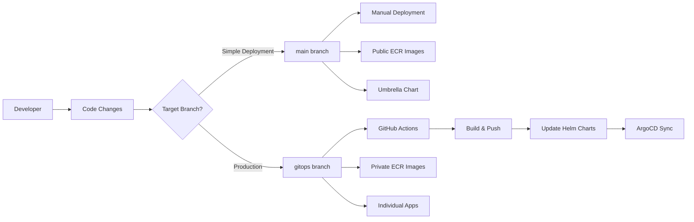

# Branching Strategy & GitOps Workflow

This document explains the advanced branching strategy and GitOps workflow implemented in this nithin-shop application.

## 📋 Table of Contents

- [Branch Architecture](#branch-architecture)
- [Public Application (Main Branch)](#public-application-main-branch)
- [Production (GitOps Branch)](#production-gitops-branch)
- [GitHub Actions Setup](#github-actions-setup)
- [Deployment Workflows](#deployment-workflows)
- [Infrastructure Components](#infrastructure-components)
- [Troubleshooting](#troubleshooting)
- [Development Workflow](#development-workflow)

## 🏗️ Branch Architecture

This repository implements a **dual-branch GitOps strategy** designed for different deployment scenarios with clear separation between simple public deployments and production-ready automated workflows.



## 🌐 Public Application (Main Branch)

### **Purpose**
Simple deployment with public container images for demos, learning, and quick testing.

### **Characteristics**
```yaml
✅ Branch: main
✅ Images: Public ECR (stable versions)
✅ Deployment: Manual Helm chart management
✅ ArgoCD: Umbrella chart (nithin-shop-app)
✅ Workflows: None (no .github/workflows/)
✅ Updates: Manual only
✅ Target: Demos, learning, simple deployments
```

### **Image Configuration**
```yaml
# All services use public ECR images
ui: nithin/nithin-shop-ui:1.2.2
catalog: nithin/nithin-shop-catalog:1.2.2
cart: nithin/nithin-shop-cart:1.2.2
checkout: nithin/nithin-shop-checkout:1.2.2
orders: nithin/nithin-shop-orders:1.2.2

# Infrastructure components
mysql: public.ecr.aws/docker/library/mysql:8.0
redis: public.ecr.aws/docker/library/redis:6.0-alpine
postgresql: public.ecr.aws/docker/library/postgres:13
rabbitmq: public.ecr.aws/docker/library/rabbitmq:3.8-management
dynamodb-local: public.ecr.aws/aws-dynamodb-local/aws-dynamodb-local:1.25.1
```

### **ArgoCD Configuration**
```yaml
# Uses umbrella chart for simplified management
apiVersion: argoproj.io/v1alpha1
kind: Application
metadata:
  name: nithin-shop-app
spec:
  source:
    targetRevision: main
    path: src/app/chart
```

## 🏭 Production (GitOps Branch)

### **Purpose**
Full production workflow with automated CI/CD pipeline and private container registry integration.

### **Characteristics**
```yaml
✅ Branch: gitops
✅ Images: Private ECR (auto-updated)
✅ Deployment: Automated via GitHub Actions
✅ ArgoCD: Individual service applications
✅ Workflows: Full CI/CD pipeline (.github/workflows/)
✅ Updates: Automatic on code changes
✅ Target: Production environments, enterprise deployments
```

### **Image Configuration**
```yaml
# Services use private ECR (updated by workflow)
ui: nithingowdahm87/shopping:nithin-shop-ui-v1.0
catalog: nithingowdahm87/shopping:nithin-shop-catalog-v1.0
cart: nithingowdahm87/shopping:nithin-shop-cart-v1.0
checkout: nithingowdahm87/shopping:nithin-shop-checkout-v1.0
orders: nithingowdahm87/shopping:nithin-shop-orders-v1.0

# Infrastructure components (same as main - preserved by workflow)
mysql: public.ecr.aws/docker/library/mysql:8.0
redis: public.ecr.aws/docker/library/redis:6.0-alpine
postgresql: public.ecr.aws/docker/library/postgres:13
rabbitmq: public.ecr.aws/docker/library/rabbitmq:3.8-management
dynamodb-local: public.ecr.aws/aws-dynamodb-local/aws-dynamodb-local:1.25.1
```

### **ArgoCD Configuration**
```yaml
# Uses individual applications for granular control
- nithin-shop-ui
- nithin-shop-catalog  
- nithin-shop-cart
- nithin-shop-checkout
- nithin-shop-orders

# Each points to gitops branch
spec:
  source:
    targetRevision: gitops
```

## 🔧 GitHub Actions Setup

### **Required Secrets**
Configure these secrets in your GitHub repository settings:

| Secret Name | Description | Example |
|-------------|-------------|---------|
| `AWS_ACCESS_KEY_ID` | AWS Access Key for ECR/EKS access | `AKIA...` |
| `AWS_SECRET_ACCESS_KEY` | AWS Secret Key | `wJalrXUt...` |
| `AWS_REGION` | AWS Region for resources | `us-west-2` |
| `AWS_ACCOUNT_ID` | AWS Account ID for ECR URLs | `123456789012` |

### **IAM Permissions Required**
```json
{
  "Version": "2012-10-17",
  "Statement": [
    {
      "Effect": "Allow",
      "Action": [
        "ecr:GetAuthorizationToken",
        "ecr:BatchCheckLayerAvailability",
        "ecr:GetDownloadUrlForLayer",
        "ecr:BatchGetImage",
        "ecr:InitiateLayerUpload",
        "ecr:UploadLayerPart",
        "ecr:CompleteLayerUpload",
        "ecr:PutImage",
        "ecr:CreateRepository",
        "ecr:DescribeRepositories"
      ],
      "Resource": "*"
    }
  ]
}
```

## 🔄 Deployment Workflows

### **Public Application Workflow**
```bash
1. Developer commits to main branch
2. Manual deployment required
3. Uses stable public images
4. ArgoCD syncs umbrella chart
5. All services deployed together
```

### **Production Workflow**
```bash
1. Developer commits to gitops branch (src/ directory)
2. GitHub Actions detects changes
3. Builds only changed services
4. Pushes images to private ECR
5. Updates Helm chart values with new image tags
6. Commits changes back to gitops branch
7. ArgoCD syncs individual applications
8. Only changed services are redeployed
```

### **Change Detection Logic**
```yaml
# Only builds services with actual code changes
Changed files in src/ui/ → Build ui service
Changed files in src/catalog/ → Build catalog service
Changed files in src/cart/ → Build cart service
Changed files in src/checkout/ → Build checkout service
Changed files in src/orders/ → Build orders service

# Manual trigger builds all services
workflow_dispatch → Build all services
```

## 🏗️ Infrastructure Components

### **Service Images vs Infrastructure Images**

#### **Service Images (Updated by Workflow)**
- **ui, catalog, cart, checkout, orders** - Application services
- **Source**: Private ECR repositories
- **Updates**: Automated via GitHub Actions
- **Versioning**: Git commit hash (7 characters)

#### **Infrastructure Images (Preserved by Workflow)**
- **mysql, redis, postgresql, rabbitmq, dynamodb-local** - Database/messaging
- **Source**: Public ECR/Docker Hub
- **Updates**: Manual only (stable versions)
- **Versioning**: Semantic versioning

### **Workflow Protection Logic**
```bash
# AWK script ensures only main service image is updated
/^image:/ { in_main_image = 1 }  # Target first image: section only
in_main_image && /repository:/ && !updated_repo { 
  # Update only if we haven't updated repository yet
}
/^[a-zA-Z]/ && !/^image:/ { in_main_image = 0 }  # Exit image section
```

## 🔧 Troubleshooting

### **SharedResourceWarning in ArgoCD**
```yaml
# Problem: Same resources deployed by multiple applications
Error: ClusterIssuer/letsencrypt-prod is part of applications argocd/nithin-shop-app and nithin-shop-ui

# Solution: Use only one deployment method per branch
Public Application branch: Use umbrella chart only
Production branch: Use individual applications only
```

### **Image Pull Errors**
```yaml
# Problem: Wrong ECR repository or missing images
Error: Failed to pull image "nithingowdahm87/shopping:nithin-shop-ui-v1.0"

# Solutions:
1. Check ECR repository exists (workflow creates automatically)
2. Verify AWS credentials have ECR permissions
3. Ensure image was built and pushed successfully
4. Check GitHub Actions logs for build failures
```

### **Workflow Not Triggering**
```yaml
# Problem: GitHub Actions not running on commits
# Solutions:
1. Ensure changes are in src/ directory
2. Check branch is 'gitops'
3. Verify GitHub Actions is enabled
4. Check workflow file syntax (.github/workflows/deploy.yml)
```

### **Infrastructure Images Being Overwritten**
```yaml
# Problem: MySQL/Redis images pointing to private ECR
# Solution: Workflow should preserve infrastructure images
# Check: AWK script in deploy.yml targets only main service image
```

## 👨‍💻 Development Workflow

### **For Public Application Changes (Main Branch)**
```bash
1. git checkout main
2. Make changes to application code
3. Update Helm chart values manually if needed
4. git commit && git push origin main
5. Deploy manually or let ArgoCD sync
```

### **For Production Changes (GitOps Branch)**
```bash
1. git checkout gitops
2. Make changes to application code in src/ directory
3. git commit && git push origin gitops
4. GitHub Actions automatically:
   - Builds changed services
   - Updates Helm charts
   - Commits changes back
5. ArgoCD automatically syncs changes
```

### **Switching Between Branches**
```bash
# To use main branch (public application)
kubectl delete -f argocd/applications/ -n argocd  # Remove production apps
git checkout main
kubectl apply -f argocd/applications/nithin-shop-app.yaml -n argocd

# To use gitops branch (production)  
kubectl delete application nithin-shop-app -n argocd  # Remove umbrella app
git checkout gitops
kubectl apply -f argocd/applications/ -n argocd  # Apply individual apps
```

## 📊 Branch Comparison

| Feature | Public Application (Main) | Production (GitOps) |
|---------|---------------------------|---------------------|
| **Target Environment** | Demos, Learning | Production |
| **Image Source** | Public ECR | Private ECR |
| **Image Updates** | Manual | Automated |
| **Deployment Method** | Umbrella Chart | Individual Apps |
| **CI/CD Pipeline** | None | GitHub Actions |
| **Change Detection** | Manual | Automatic |
| **Rollback Strategy** | Manual | Git revert |
| **Infrastructure Images** | Public (stable) | Public (preserved) |
| **Service Images** | Public (stable) | Private (dynamic) |

## 🎯 Best Practices

### **When to Use Public Application (Main Branch)**
- ✅ Demos and presentations
- ✅ Learning and experimentation
- ✅ Quick testing and prototyping
- ✅ Simple deployments without CI/CD needs

### **When to Use Production (GitOps Branch)**
- ✅ Production deployments
- ✅ Enterprise environments
- ✅ Automated testing pipelines
- ✅ Continuous deployment workflows

### **Security Considerations**
- 🔒 Use IAM roles with minimal permissions
- 🔒 Rotate AWS access keys regularly
- 🔒 Enable ECR image scanning
- 🔒 Use branch protection rules
- 🔒 Review automated commits

---

This branching strategy provides a robust foundation for both stable production deployments and rapid development cycles while maintaining clear separation of concerns and automated quality gates.
